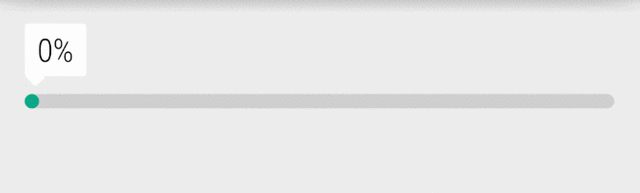

# RopeProgressBar

Android ProgressBar that "bends" under its own weight.



---
### Attributes

| Attribute                | Type      | Default                       | Usage                                                        |
| ------------------------ | --------- | ----------------------------- | ------------------------------------------------------------ |
| `app:ropeMax`            | integer   | 0                             | The max value of the progress bar                            |
| `app:ropeProgress`       | integer   | 0                             | The current value of the progress bar                        |
| `app:ropePrimaryColor`   | color     | `@attr/colorControlActivated` | Color used for the progress completed                        |
| `app:ropeSecondaryColor` | color     | `@attr/colorControlHighlight` | Color used for the progress remaining                        |
| `app:ropeSlack`          | dimension | 32dp                          | The max vertical "bend" of the progress bar                  |
| `app:ropeStrokeWidth`    | dimension | 8dp                           | The width of the progress bar line                           |
| `app:ropeDynamicLayout`  | boolean   | false                         | If the progress bar should change in height as slack changes |

*Note: Pre-Lollipop, `app:ropePrimaryColor` defaults to [#009688](http://www.color-hex.com/color/009688) and `app:ropeSecondaryColor` defaults to [#DADADA](http://www.color-hex.com/color/dadada)*


---
### Download

```groovy
repositories {
    maven {
        url "https://jitpack.io"
    }
}

dependencies {
    compile 'com.github.cdeange:RopeProgressBar:0.1.2'
}
```

---
### Developed By
- Christian De Angelis - <de@ngelis.com>

---
### License

```
Copyright 2016 Christian De Angelis

Licensed under the Apache License, Version 2.0 (the "License");
you may not use this file except in compliance with the License.
You may obtain a copy of the License at

   http://www.apache.org/licenses/LICENSE-2.0

Unless required by applicable law or agreed to in writing, software
distributed under the License is distributed on an "AS IS" BASIS,
WITHOUT WARRANTIES OR CONDITIONS OF ANY KIND, either express or implied.
See the License for the specific language governing permissions and
limitations under the License.
```
